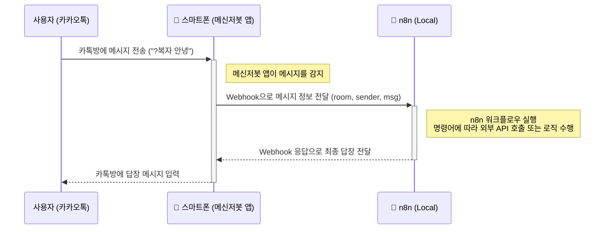

# 🤖 카카오톡 메신저봇 n8n 웹훅 연동 시스템
메신저봇R API2를 사용하여 카카오톡 메시지를 n8n 워크플로우와 연동하는 자동화 시스템입니다.

## 📋 목차

- [개요](#개요)
- [기능](#기능)
- [시스템 구조](#시스템-구조)
- [설치 및 설정](#설치-및-설정)
- [사용법](#사용법)
- [n8n 워크플로우 설정](#n8n-워크플로우-설정)
- [트러블슈팅](#트러블슈팅)
- [기여](#기여)

## 📖 개요

이 프로젝트는 카카오톡 메신저봇과 n8n 자동화 플랫폼을 연동하여 카카오톡 메시지를 처리하고 자동 응답하는 시스템입니다.

### 주요 특징

- 🔄 **실시간 메시지 처리**: 카카오톡 메시지를 실시간으로 n8n으로 전송
- 🛡️ **안정적인 에러 핸들링**: 다단계 안전장치와 상세한 에러 처리
- 📝 **상세한 로깅**: 디버깅과 모니터링을 위한 종합적인 로그 시스템
- 🎯 **선택적 메시지 처리**: 특정 방과 키워드만 처리
- 🔧 **유연한 설정**: 쉬운 설정 변경 및 커스터마이징

## ⚡ 기능

### 메신저봇 기능

- 특정 카카오톡 방에서 키워드로 시작하는 메시지 감지
- JSON 형태로 메시지 데이터를 n8n 웹훅으로 전송
- n8n에서 받은 응답을 카카오톡으로 자동 회신
- 관리자 권한 및 방 필터링 기능

### n8n 연동 기능

- HTTP POST 요청을 통한 메시지 데이터 전송
- JSON 및 텍스트 응답 처리
- 타임아웃 및 에러 상황 대응
- 다양한 응답 형식 지원

## 🏗️ 시스템 구조

```
카카오톡 메시지 → 메신저봇 → n8n 웹훅 → n8n 워크플로우 → 응답 → 카카오톡
```

### 시퀀스 다이어그램



### 데이터 흐름

1. **메시지 수신**: 카카오톡에서 특정 키워드로 시작하는 메시지 감지
2. **데이터 전송**: 메시지 정보를 JSON으로 n8n 웹훅에 POST 요청
3. **워크플로우 처리**: n8n에서 메시지 처리 및 응답 생성
4. **응답 회신**: 처리된 응답을 카카오톡으로 자동 전송

## 🛠️ 설치 및 설정

### 필요 환경

- **메신저봇R**: API2 지원 버전
- **n8n**: 자동화 워크플로우 플랫폼
- **안드로이드 기기**: 메신저봇 실행용

### 메신저봇 설정

1. 메신저봇R 앱 설치 및 권한 설정
2. `n8n-webhook-msgbot-src.js` 파일을 메신저봇에 로드
3. CONFIG 섹션에서 설정 수정:

```javascript
var CONFIG = {
    BOT_NAME: "n8n 웹훅 연동봇 v3.0",
    // WEBHOOK_URL: "http://YOUR_SERVER:5678/webhook-test/n8n-kakaotalk-from-msg", // (test-url)
    WEBHOOK_URL: "http://YOUR_SERVER:5678/webhook/n8n-kakaotalk-from-msg", // (production-url)
    TARGET_ROOMS: ["방이름1", "방이름2", "방이름3"],
    CALL_KEYWORD: "?키워드",
    BUTLER_LIST: ['관리자1', '관리자2'],
    TIMEOUT: 45000,
    DEBUG_MODE: true
};
```

### n8n 설정

1. n8n 서버 설치 및 실행
2. 제공된 워크플로우 JSON을 n8n에 임포트
3. 웹훅 URL을 메신저봇 설정과 일치시키기

## 📖 사용법

### 기본 사용법

1. 설정된 카카오톡 방에서 키워드로 메시지 전송:
   ```
   ?복자 안녕하세요!
   ```

2. 메신저봇이 자동으로 n8n에 다음 데이터 전송:
   ```json
   {
     "msg": "?복자 안녕하세요!",
     "room": "방이름",
     "sender": "보낸사람"
   }
   ```

3. n8n에서 처리 후 응답을 카카오톡으로 자동 전송

### 설정 커스터마이징

#### 대상 방 변경
```javascript
TARGET_ROOMS: ["새로운방", "다른방", "테스트방"]
```

#### 키워드 변경
```javascript
CALL_KEYWORD: "!키워드"
```

#### 타임아웃 조정
```javascript
TIMEOUT: 30000  // 30초
```

## 🔧 n8n 워크플로우 설정

### 기본 워크플로우 구조

1. **Webhook 노드**: 메신저봇에서 POST 요청 수신
   - Method: POST
   - Path: `n8n-kakaotalk-from-msg`
   - Response Mode: Response Node

2. **Edit Fields 노드**: 응답 메시지 생성
   - `response_text` 필드에 응답 메시지 설정
   - 메시지 변수 활용: `{{ $json.body.msg }}`

3. **Respond to Webhook 노드**: 메신저봇에 응답 전송
   - Response Body: `{{ $json.response_text }}`
   - Response Code: 200

### 고급 워크플로우 예시

```javascript
// Edit Fields 노드에서 조건부 응답
{
  "response_text": "{{ $json.body.msg.includes('날씨') ? '오늘 날씨는 맑습니다!' : '안녕하세요! 메시지를 받았습니다.' }}"
}
```

### 외부 API 연동

워크플로우에 HTTP Request 노드를 추가하여 외부 API와 연동 가능:

1. **HTTP Request 노드** 추가
2. **외부 API 호출** (날씨, 번역, AI 등)
3. **응답 데이터 가공** 후 메신저봇에 전송

## 🔍 트러블슈팅

### 일반적인 문제

#### "메신저봇 오류" 메시지가 나타날 때

1. **네트워크 연결 확인**
   - n8n 서버가 실행 중인지 확인
   - 웹훅 URL이 정확한지 확인

2. **로그 확인**
   ```
   [DEBUG] 모드를 활성화하여 상세 로그 확인
   ```

3. **타임아웃 조정**
   ```javascript
   TIMEOUT: 60000  // 더 긴 타임아웃 설정
   ```

#### 메시지가 전송되지 않을 때

1. **방 이름 확인**: `TARGET_ROOMS`에 정확한 방 이름 등록
2. **키워드 확인**: 메시지가 `CALL_KEYWORD`로 시작하는지 확인
3. **권한 확인**: 메신저봇 접근성 권한 활성화

#### n8n에서 빈 데이터를 받을 때

1. **메신저봇 코드 버전 확인**: Ver 1.0 사용 권장
2. **웹훅 URL 일치 확인**: 메신저봇과 n8n 설정 비교
3. **Content-Type 헤더 확인**: `application/json` 설정

### 로그 분석

#### 정상 동작 로그 예시
```
[INFO] 메시지 수신 - 방: 테스트방, 발신자: 사용자, 내용: ?복자 안녕
[DEBUG] 필터링 체크 - 방: 테스트방 (유효: true), 키워드: true
[INFO] 웹훅 호출 시작: http://server:5678/webhook/...
[INFO] 웹훅 응답 수신 - 상태코드: 200
[INFO] n8n 응답 성공: 안녕하세요! 메시지를 받았습니다.
```

#### 에러 로그 분석
- `[ERROR]`: 시스템 오류 발생
- `timeout`: 응답 시간 초과
- `connect`: 네트워크 연결 실패
- `파싱 실패`: 응답 데이터 처리 오류

## 🚀 추후 고급 활용

### 다중 워크플로우 연동

```javascript
// 메시지 내용에 따라 다른 웹훅 호출
var webhookUrls = {
    "날씨": "http://server:5678/webhook/weather",
    "번역": "http://server:5678/webhook/translate", 
    "기본": "http://server:5678/webhook/default"
};
```

### 관리자 전용 기능

```javascript
// BUTLER_LIST에 등록된 사용자만 특정 기능 사용
if (MessageFilter.isButler(msg.author.name)) {
    // 관리자 전용 로직
}
```

### 메시지 형식 검증

```javascript
// 특정 형식의 메시지만 처리
var messagePattern = /^키워드\s+(.*)/;
if (messagePattern.test(msg.content)) {
    var command = messagePattern.exec(msg.content)[1];
    // 명령어 처리
}
```
---

⭐ 이 프로젝트가 도움이 되었다면 스타를 눌러주세요! 
